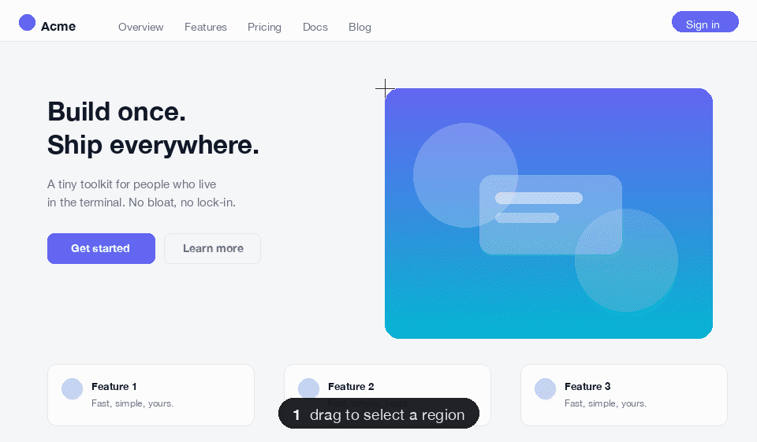
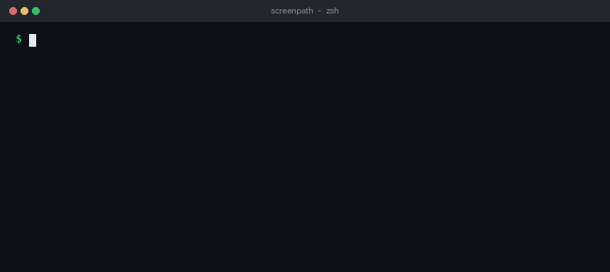

# screenpath

[](https://github.com/truth0530/screenpath/actions/workflows/ci.yml)

**Capture a screen region and copy its file _path_ to the clipboard — not the image.**



macOS screenshot tools copy the **image**, which is useless in the terminal, over SSH,
in **tmux**, or with AI agents — there you reference a screenshot by its **file path**.
`screenpath` copies that path: one keystroke from screen to a paste-ready path.
(Windows has this via ShareX; macOS doesn't.)

It lives **alongside** your normal screenshot app — keep Shottr/CleanShot for
image-copy, bind `screenpath` to a different hotkey for the path-copy case.

<details>
<summary><b>Why not the built-in tools?</b></summary>

| You could… | …but |
| --- | --- |
| `Cmd-Shift-4` / `Cmd-Shift-5` | saves a file, but puts **nothing** on the clipboard. |
| `Cmd-Ctrl-Shift-4` | copies the **image**, which a terminal / tmux / SSH session can't accept. |
| Drag from Finder, or "Copy as Pathname" | needs the shot to exist and a Finder window open — steps, every time. |
| CleanShot X / Shottr | great apps, but they copy the **image** by default (CleanShot is paid). |
| a `screencapture … && pbcopy` alias | basically the idea — screenpath is that, plus modes, shell-safe quoting, a permission check, and hotkey docs. |

</details>

## Install

```sh
brew install truth0530/tap/screenpath
```

Shell completions (bash + zsh) are installed automatically.

## Quick start

```sh
screenpath            # drag to select a region; path is copied + printed
screenpath --window   # pick a window instead
screenpath --full     # whole screen, no selection
screenpath --setup    # how to bind a global hotkey
```

To make it useful, bind a **global hotkey** (below).

## Usage

```
screenpath [options]

  -d, --dir DIR       Save screenshots here (default: ~/Screenshots, or $SCREENPATH_DIR)
  -p, --prefix NAME   Filename prefix (default: shot, or $SCREENPATH_PREFIX)
      --tmp           Save to a temp dir ($TMPDIR/screenpath) instead of ~/Screenshots
  -w, --window        Capture a window instead of dragging a region
  -f, --full          Capture the whole screen (no selection)
  -i, --image         Copy the IMAGE to the clipboard instead of the path
  -Q, --quote         Copy a shell-quoted path (safe to paste even with spaces)
  -u, --url           Copy a file:// URL instead of a plain path
  -l, --link          Point a fixed "latest" symlink at this shot
  -n, --no-clip       Don't touch the clipboard; just print the path
      --notify        Show a macOS "Path copied" notification (off by default)
      --setup         Print hotkey setup instructions
  -v, --version       Print version
  -h, --help          Show this help
```



**Notes**

- **Quiet by default** — pass `--notify` (or `SCREENPATH_NOTIFY=1`) for a macOS
  "Path copied" notification.
- **Spaces in the path?** `--quote` keeps it a single shell argument; `--url` emits a
  `file://…` URL (UTF-8 safe).
- **A fixed path** — `--link` (or `SCREENPATH_LINK`) keeps `latest.png` pointing at the
  newest shot, so you can just reference `~/latest.png` without pasting anything.
- **No overwrites / cleanup** — filenames are timestamped (millisecond + counter on
  collision); set `SCREENPATH_DIR`/`SCREENPATH_PREFIX`, or use `--tmp` (a `screenpath/`
  subdir under `$TMPDIR`) for throwaway shots. screenpath never deletes files.
- **Exit status** — `0` = path captured & printed (or selection cancelled, with empty
  output); `1` = capture/clipboard/permission failure; `2` = usage error. In a script,
  treat empty stdout as "nothing captured".

## Global hotkey

macOS won't let a CLI self-bind a hotkey, so you bind one once. **Raycast** (smoothest):

```sh
# 1. In Raycast: Settings → Extensions → Script Commands → Add Directories
#    (Raycast has no default folder — it only scans directories you add.)
# 2. Install into that exact directory:
screenpath install-raycast <that-directory>
# 3. Assign a Hotkey to "Screenpath" in Raycast.
```

<details>
<summary>Other options (macOS Shortcuts, skhd)</summary>

**Shortcuts.app** — new shortcut → *Run Shell Script* → `screenpath` (use the full
path from `which screenpath` if needed) → *Add Keyboard Shortcut*.

**skhd** (pick a chord that's free — `cmd+shift+5` is taken by macOS's own screenshot UI)
```sh
brew install koekeishiya/formulae/skhd
echo 'cmd + shift + 6 : screenpath' >> ~/.config/skhd/skhdrc
skhd --start-service
```

Run `screenpath --setup` to reprint these.
</details>

## Permissions & scope

- **macOS only** — uses `screencapture`, `pbcopy`, `osascript`. Linux (`grim`/`slop` +
  `wl-copy`) isn't supported yet; PRs welcome.
- The first capture needs **Screen Recording** permission (*System Settings → Privacy &
  Security*). An empty file means it's missing — screenpath tells you instead of
  silently copying nothing.
- One auditable Bash file ([`bin/screenpath`](bin/screenpath)), no network, no
  telemetry. Homebrew may ask you to trust the tap (normal for non-core formulae).

## Changes

See [CHANGELOG.md](CHANGELOG.md).

## License

MIT — see [LICENSE](LICENSE).
